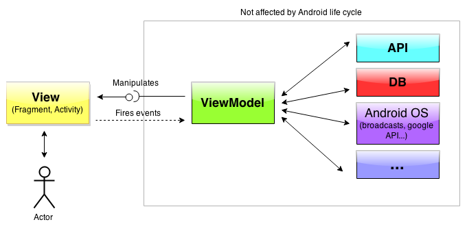
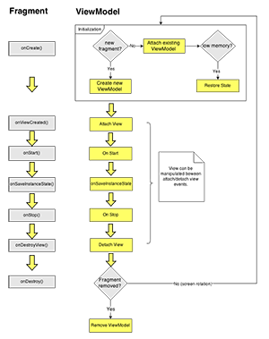

AndroidViewModel
================

Separating data and state handling from Fragments or Activities without lots of boilerplate-code. Reducing them to simple <i>dumb views</i>.

<b>Basic idea behind this library</b>.
An instance of a ViewModel class is assigned to your Fragment or Activity during the first creation and is kept during it's life cycle, even between display orientation changes. The ViewModel instance is removed after the Fragment or Activity is completely gone (finished, popped from backstack, replaced without keeping it in backstack).

You can execute asynchronous tasks in this ViewModel instance and this class is not destroyed during orientation change. All data handling and state logic should be placed inside this class. The Fragment or Activity is just a "dumb" view.



How to implement
--------

1. Create an interface for your <b>View</b> by extending [IView](library/src/main/java/eu/inloop/viewmodel/IView.java). We will call it IUserListView for this example.

   ```java
   
  public interface IUserListView extends IView {
      public void showUsers(List<User> users);
  }
   ```
2. Create your <b>ViewModel</b> class by extending [AbstractViewModel](library/src/main/java/eu/inloop/viewmodel/AbstractViewModel.java). For example: <br/>

   ```java
   public class UserListViewModel extends AbstractViewModel<IUserListView> {
      ....
   }
   ```
3. Each <b>Fragment</b> or <b>Activity</b> that you would like to associate with a ViewModel will need either to extend [ViewModelActivityBase](library/src/main/java/eu/inloop/viewmodel/base/ViewModelBaseActivity.java)/[ViewModelBaseFragment](library/src/main/java/eu/inloop/viewmodel/base/ViewModelBaseFragment.java) or copy the implementation from these classes to your base activity/fragment class (in case you can't inherit directly). Override ```getViewModelClass()``` to return the corresponding ViewModel class. For example: <br/>
  
  ```java
  public class UserListFragment extends ViewModelBaseFragment<IUserListView, UserListViewModel> 
      implements IUserListView {
      
     @Override
      public Class<UserListViewModel> getViewModelClass() {
          return UserListViewModel.class;
      }
      
  }
  ```
  
How to use
--------

You can forward user interaction from the View into the ViewModel simply by calling:

  ```java
  getViewModel().onDeleteUserClicked(userId);
  ```
  
The same goes for the opposite direction, when your asynchronous operation in the ViewModel finished and you would like to forward data to the View to show a list for example:

  ```java
  if (getView() != null) {
      getView().showUsers(userList);
  }
  ```

Your Fragment argument Bundle and Activity intent Bundle is forwarded to the ViewModel's onCreate method, which you can override to read the initial arguments for the ViewModel.

   ```java 
   public void onCreate(Bundle arguments, Bundle savedInstanceState) {
      long userId = arguments.getInt("user_id", -1);
   }
   ``` 

<b>How does it work?</b>

A unique global ID is generated for the first time your Fragment or Activity is shown. This ID is passed on during orientation changes. Opening another instance of the same Fragment or Activity will result in a different ID. The ID is unique screen identifier. A ViewModel class is created and bound to this ID. The corresponding ViewModel instance is attached to your Fragment or Activity after an orientation change or if you return to the fragment in the back stack.
The ViewModel is discarded once the Fragment/Activity is not reachable anymore (activity is finished or fragment permanently removed).

<b>Why no controller layer?</b>

This is not a strict MVC/MVP architecture - simply because we felt that having another layer between the "model" and the view does not bring enough advantages. So to further reduce the code this was simplified, where the Model is talking to the View over an interface. In mobile application most of the code is about interaction with the UI (getting data from API/DB, showing the data, manipulating, saving) so a more direct connection between the layers felt appropriate. 

<b>Sample Workflow</b>:

1. <small>Fragment is shown to user. A ViewModel is assigned.</small>
2. Fragment notifies the View that it's ready. 
3. ViewModel starts the async task to load data. Tells the view to show progress.
4. User rotates the display. The ViewModel continues with the loading part.
5. The Fragment is recreated after the orientation change is assigned the same ViewModel instance.
6. Recreated Fragment tells the ViewModel that it's ready. ViewModel tells the UI to show loading, because it's still loading the data.
7. ViewModel finishes the async task and tells the Fragment to show the data.
8. User leaves the Activity, the Fragment is destroyed and the ViewModel is removed.

[](website/static/lifecycle.png)


Download
--------

Grab via Gradle:
```groovy
compile 'eu.inloop:androidviewmodel:0.3'
```
or Maven:
```xml
<dependency>
  <groupId>eu.inloop</groupId>
  <artifactId>androidviewmodel</artifactId>
  <version>0.3</version>
</dependency>
```
Build and study sample application from source code or download from Google Play.<br/>
[](https://play.google.com/store/apps/details?id=eu.inloop.viewmodel.sample)

<b>Development status:</b> Used internally at company on some production applications. Library is under development and API changes might occur anytime. But it should be usuable at this point without any big issues (like memory leaks).
